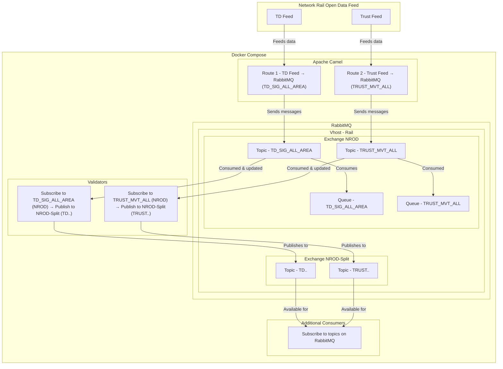

# NROD Docker

## Overview
This repository provides a **Docker Compose setup** for working with **Network Rail Open Data (NROD)** feeds. It demonstrates how to ingest and process messages from the open data feed using **Apache Camel** and **RabbitMQ**, while also providing example **data validators** written in Python.

This is intended as a learning resource and a base for developing custom applications that consume and process railway data. **It is not production-ready.**

## System Architecture

### **1. Apache Camel (Data Ingestion)**
- Connects to the **Network Rail Open Data Feed**.
- Subscribes to specific **message topics**.
- Forwards these messages to the **RabbitMQ broker** on a defined vhost/exchange.
- Creates a queue bound to that topic for downstream processing.

### **2. RabbitMQ (Message Broker)**
- Acts as an intermediary for message passing.
- Uses **topic exchanges** to route messages to relevant consumers.
- Includes a **web UI** for managing queues and exchanges.
- Does **not** use HTTPS as it is a local setup.

### **3. Data Validators (Example Consumers)**
Two **example subscriber applications** (validators) written in Python demonstrate how messages can be processed:

#### **Trust Validator (validator_trust)**
- Listens to incoming messages.
- Processes **Trust** messages.
- Publishes messages back to RabbitMQ with routing keys formatted as:
  ```
  TRUST.<message_type>.<toc_id>
  ```
  Example: If filtering for **Trust messages of type 0003**, create a queue using:
  ```
  TRUST.0003.*
  ```
  Or subscribe to **all Trust messages** using:
  ```
  TRUST.#
  ```

#### **TD Validator (validator_td)**
- Processes **TD (Train Describer) messages**.
- Publishes messages back to RabbitMQ using routing keys:
  ```
  TD.<message_type>.<td_area>
  ```
  Example: A queue for **CA messages in area X0**:
  ```
  TD.CA.X0
  ```
  Example: A queue for **C Class messages in area X0**:
  ```
  TD.C*.X0
  ```
  Or subscribe to **all TD messages**:
  ```
  TD.#
  ```

This setup allows additional **consumers/applications** to subscribe to topics as needed.

### **System Diagram**


## Setup Instructions
### **1. Clone the Repository**
```bash
git clone https://github.com/your-repo/nrod-docker.git
cd nrod-docker
```

### **2. Configure Environment Variables**
- Copy the `.env` files provided and update the values as needed.
- The `.env` files simplify the configuration of services.

### **3. Update Open Data Feed Credentials**
The credentials for the **Network Rail Open Data feed** must be updated in [camel.xml](./camel/src/main/resources/camel.xml):
```bash
camel/src/main/resources/camel.xml
```
Replace:
```xml
<nrod_username> with your username
<nrod_password> with your password
<rabbitmq_username> with your rabbitmq username
<rabbitmq_password> with your rabbitmq password
<rabbitmq virtual host> with your rabbitmq username
<rabbitmq exchange> with your rabbitmq excahnge
```
with your valid credentials.

### **4. Start the Services**
Run the following command to start the entire system:
```bash
docker-compose up --build
```
This will:
- Start RabbitMQ with the management UI.
- Build and run the Apache Camel container.
- Build and run the Python validator services.

To stop the system, run:
```bash
docker-compose down
```

## File Structure
```
C:.
│   .env                      # Global environment variables
│   docker-compose.yml        # Docker Compose configuration
│   README.MD                 # This documentation
│
├───camel                     # Apache Camel application
│   │   dockerfile            # Docker build instructions
│   │   pom.xml               # Maven dependencies for Spring Boot
│   │
│   └───src/main
│       ├───java/com/example  # Java source code
│       │       Application.java
│       │
│       └───resources
│               application.properties  # Spring Boot settings
│               camel.xml                # Camel routing logic
│
├───validator_td              # TD Validator (Python)
│       .env                  # Environment variables
│       dockerfile            # Docker build instructions
│       requirements.txt      # Python dependencies
│       td_processor.py       # TD message processing logic
│
└───validator_trust           # Trust Validator (Python)
        .env                  # Environment variables
        dockerfile            # Docker build instructions
        requirements.txt      # Python dependencies
        trust_processor.py    # Trust message processing logic
```

## Expanding the System
- Add new **subscribers** to process different message types.
- Extend `camel.xml` to handle additional routing and transformations.
- Modify the **Python processors** to perform custom logic before republishing messages.
- Integrate with databases for historical logging and analytics.

## Notes
- This is a **local development setup** and is not intended for production use.
- Ensure your **NROD credentials** are correct before running.
- RabbitMQ’s **web UI** is enabled for ease of monitoring and queue management.
- `.env` files are used to configure **RabbitMQ**, **Camel**, and **validators**.

## License
This project is licensed under the **MIT License**—you are free to use, modify, and distribute it as needed.

### Open Source Components
This project makes use of the following open-source technologies:
- **[RabbitMQ](https://www.rabbitmq.com/)** – A message broker for handling communication between services.
- **[Apache Camel](https://camel.apache.org/)** – An integration framework used for message routing and transformation.

Feel free to modify and expand this project as needed! Or get in touch for feedback/questions.


